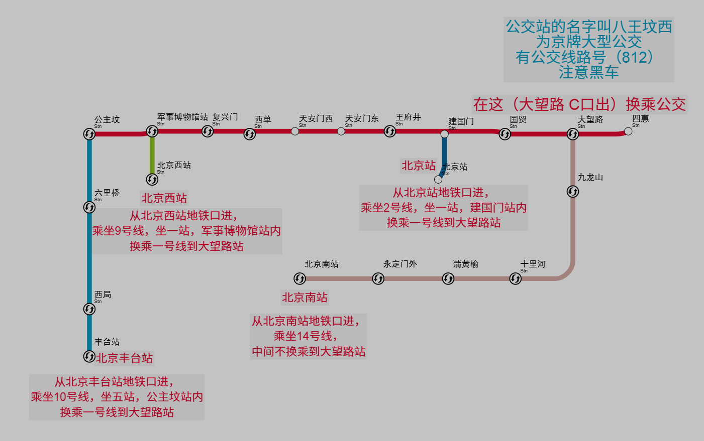

# 来校路线

## 1. 自驾

自驾可以根据宿舍所在地区导航：

### 北二校区（原防灾科技学院北区）
高德地图上叫应急管理大学北二校区，宿舍位置为左上角。

### 北一校区（原华北科技学院北区）
高德地图上叫应急管理大学北一校区，除了三食堂和校医院以外，全是宿舍。

### 东区（原华北科技学院中区）
高德地图上叫应急管理大学东区，宿舍在图书馆南侧，一食堂西侧，建议导航应急管理大学天桥或者中区北门，从天桥下门进入会比较好。

### 西区（原防灾科技学院南区）
高德地图上叫应急管理大学西区，宿舍在思源餐厅南侧，明德楼（西）东侧，建议导航应急管理大学南门或防灾科技学院南门。

以上为学校的四个宿舍区，建议根据所学专业的宿舍位置选择导航位置，不过如果不知道宿舍位置的，可以导航到报到处所在位置，这个每年不一样，具体看招新群。

**自驾过来，大概率需要经过北京，需要办进京证（北京交警App），如果没有北京旅游计划，五环外即可，可在导航软件上绑定车牌，这样他会帮你避开限行。**

## 2. 高铁/火车

公交卡和地铁卡无需办理，打开支付宝，首页选出行，地址选北京，就会出现北京轨道交通乘车码和北京公交乘车码，具体根据你选的交通方式进行选择，当然如果你手机支持nfc，也可以在钱包办理，进出站直接刷NFC，就不用打开支付宝了。

### 从北京火车站下车
出站乘坐2号线至崇文门转1号线至大望路站下车，换乘812路专线或支线公共汽车，到华北科技学院站（812路到校历时约45分钟）下车即到，票价七元。公交卡大部分3.7元左右。

### 从北京西客站下车
从西客站站内乘坐地铁9号线至军博转1号线到大望路站B口出，出站左拐，换乘812路专线或支线公共汽车，到华北科技学院站下车即到。

### 从北京南站下车
地铁4号线至西单转1号线至大望路站下车，换乘812路专线或支线公共汽车下车即到。

### 从北京丰台站下车
从北京丰台站地铁口进，乘坐10号线，坐五站，公主坟站内换乘一号线到大望路站，换乘812路专线或支线公共汽车，到华北科技学院站下车即到。

### 从北京市内乘坐地铁
到地铁1号线(苹果园-四惠东)大望路站下车，走上地面到八王坟东站换乘812路专线或支线公共汽车，到华北科技学院站（812路到校历时约45分钟）下车即到。

### 学校专车
学校有专车接送，会收一些钱，不贵。正式报道那两天会有专车接送，有学长学姐在北京西站以及北京站接人，北京南站不确定。

**特别提示：818，812公共汽车全部为北京市公交车（北京牌照），请到有站牌的站点上车，以防有不法营运者假冒公共汽车之名揽客宰客。注意人身及财物安全。**

以上线路均为笔者写的时候，高德推荐路线，但公共交通存在不确定因素，建议大家下高铁后打开高德，按照高德的推荐路线走。

凭借录取通知书可于本地火车站购买优惠火车票（坐票半价，卧铺75折，高铁动车75折），尤其是路途遥远的同学。

## 3. 飞机

北京有两个民用机场，大兴机场和首都机场，大兴离学校较远，首都较近。

但笔者暂时还没有坐飞机来学校的经历，不过，仍然是下了飞机，打开高德，百度地图，导航永远不会出错。

北京市公交车均为北京牌照，请到有站牌的站点上车，以防有不法营运者假冒公共汽车之名揽客宰客。注意人身及财物安全。

## 4. 大巴

对于大巴来说，北京有较多的客运站，不要怕，只要你的大巴到北京，就可以，出来车站，打开高德地图，地铁，公交开坐。

北京市公交车均为北京牌照（大巴不一定，但一定要保证他有营运资质，人生财产安全最重要），请到有站牌的站点上车，以防有不法营运者假冒公共汽车之名揽客宰客。注意人身及财物安全。

---

**新生提示：**
- 以上线路均为高德推荐路线，但公共交通存在不确定因素
- 建议大家下高铁后打开高德，按照高德的推荐路线走
- 凭借录取通知书可于本地火车站购买优惠火车票（坐票半价，卧铺75折，高铁动车75折）