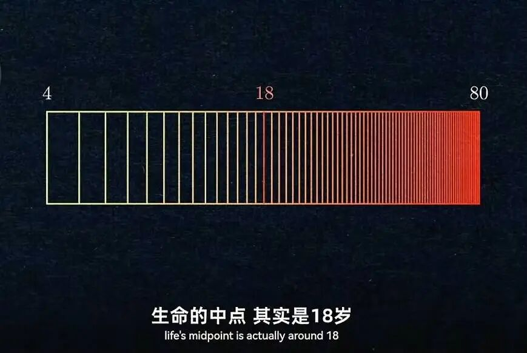

# 写在前面

本 Wiki 由东院网络 B242 的 Edge 和物联 B241 的 learnerCodeZ 发起，多名同学共同参与编写的校内生活指南，致力于建立一个完整、准确且中立的应大百科全书。

## 内容

虽说本Wiki的目标是建立一个中立的百科全书，但校园毕竟是我们自己生活和发展的地方，很难完全排除感情的影响。作为大学生，应当养成良好的辨别能力和信息素养。

授人以鱼不如授人以渔，本文尽力给出一些简单的思考和行为方法，但这些方法仅代表文章原作者的思想与原则，而不是你必须遵守的行动指南。

## 真正的指南

说实话，大学不过是人生中的一个片段，在你的对数感觉中，大学不过是生命中点的记录，应大Wiki 无法囊括校园生活的全部细节。它的目的是为打破一定的信息差，初步的了解校园，规划大学生活，帮助你了解校园中的一些必备知识，但真正生活指南远不止于此。

实践是检验真理的唯一标准，任何经验和知识都来源于真实的社会实践。在应大，你要经历种种事情，学习，生活，成长，最终会形成独属于你的生活指南。应大wiki能带给你的，只有在你初来乍到时，或者需要面对大学里新的问题时，一本可以随时翻阅的手册，帮助你打开这个大门，更好的开启和适应大学生活。

应大很大，有些人，有些事，刻意去见面，去经历，可能到毕业都很难再遇见，应大又很小，"你会不会突然得出出现"，——你可能会在学校的不同角落，遇见相同的人和事。

应大的时光，只是你人生中小小的一站，但我们希望通过这个wiki，帮助你更好的发现自我，探索世界。

